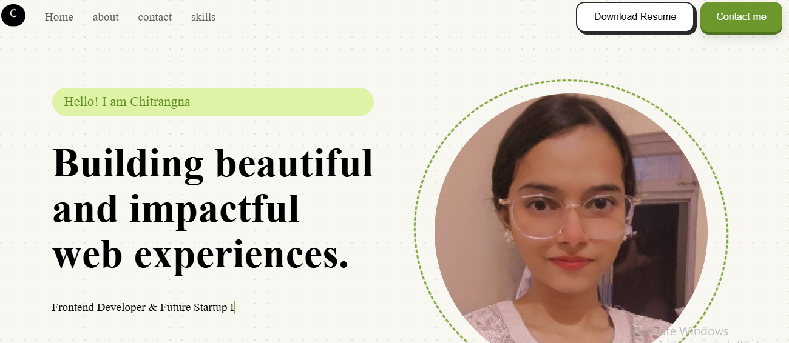

<h1 align="center">Chitrangna — Developer Portfolio</h1>


<p align="center">
My personal developer portfolio — showcasing who I am, what I'm building, and the projects I've shipped so far as a first-year CSE student on the MERN stack journey. Built with a focus on clean UI, smooth animations, and responsive design.
</p>

<p align="center">
  <strong><a href="https://chitrangna.netlify.app/">🌐 Live Demo</a></strong>
</p>

---

##  Preview

<p align="center">
  
</p>

<!--##  Demo
<p align="center">
  
</p>
----->

##  Features

- Custom preloader animation with a constellation-orbit design (Font Awesome icons)
- Fully responsive layout — built mobile-first with Flexbox & Grid
- About section with my journey, goals, and current tech stack
- Projects section showcasing my work (Calculator, BMI Calculator, Counter App, Triangle Type Checker, and more)
- Skills section with a clean, organized tech stack display
- Smooth scroll navigation and section transitions
- Social links (GitHub, LinkedIn) for easy connect
- Dark, minimal aesthetic tuned for readability and focus

---

##  Built With

- HTML5
- CSS3 (Flexbox, Grid, Media Queries)
- JavaScript (ES6)
- React

---

## Getting Started

Clone the repository:
```bash
git clone https://github.com/chitrangna-dev/portfolio.git
```

Move into the project folder:
```bash
cd portfolio
```

Install dependencies (if using React):
```bash
npm install
```

Run the project locally:
```bash
npm start
```

Or, if it's a static HTML/CSS/JS build, just open `index.html` in your preferred web browser.

---

##  Why I Built This

I built this portfolio to have a single place that represents me as a developer — my skills, my projects, and my growth. It's also where I practice everything I learn: responsive design, animations, clean component structure, and deployment workflows — turning theory into something real and shippable.

---

## Possible Improvements

- Add a blog/notes section to document my learning journey
- Add dark/light mode toggle
- Add project filtering by tech stack
- Add a contact form with backend integration (Node.js/Express)
- Improve accessibility (ARIA labels, keyboard navigation)

---

##  Author

**Chitrangna**
First-year B.Tech CSE student, building toward full-stack development with the MERN stack. Passionate about clean UI, meaningful projects, and continuous learning.
Feel free to explore the project or share your feedback.

---

##  License

This project is licensed under the MIT License.
